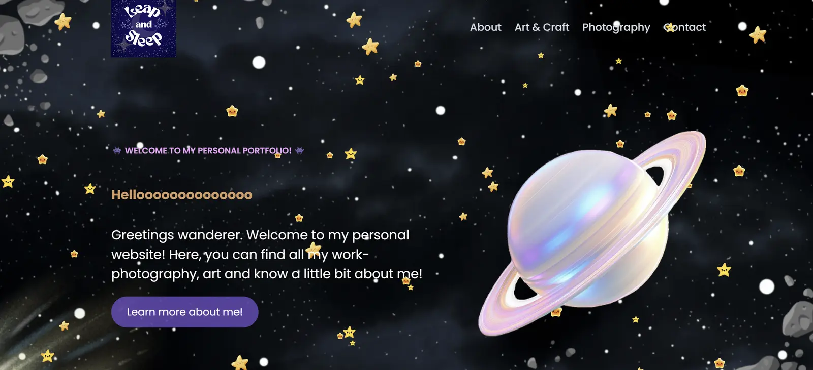

# Leap & Sleep

A personal creative website exploring photography, art, projects, and the things I enjoy making.



## Try my project

**[Visit Leap & Sleep](https://shreya-nair-28.github.io/Personal-Site-leapandsleep-/)**

## ✨ Features

-  **Home** — an interactive introduction to the site
-  **About** — learn a little about me through interactive elements
-  **Art & Craft** — browse my artwork and DIY projects through a clickable gallery
-  **Photography** — explore my photography through an interactive gallery
-  **My Journey** — fly through an interactive space-themed journey and discover different parts of my life
-  **Contact** — connect with me and interact with a small Q&A feature

## 🛠️ Built with

- HTML
- CSS
- JavaScript
- GitHub Pages
- Canva for some of the visual assets

## Why I made this

I wanted to build my own website instead of relying entirely on a website builder.

I already had a WordPress website, but I wanted more control over the design and the freedom to experiment with how a website could feel and behave.

This project started as a way to learn HTML and CSS and gradually became a space to experiment with layouts, animations, interactions, and GitHub Pages.

I initially used ChatGPT for the basic HTML structure, but built the pages, styling, and interactions myself while working through the guides and external websites. A lot of trial and error was involved.

##  How it works

The site is made from separate HTML pages that share one main CSS file.

JavaScript is used for the interactive parts of the website, including image galleries, popups, the contact-page Q&A, animations, and the interactive journey.

The site is completely static, so it can be hosted directly through GitHub Pages without a backend.

## What I've used

-Visual assets designed using Canva
-Fonts from Google Fonts
-Built with HTML, CSS and JavaScript

## Project structure

```text
index.html          ~ Home
about.html          ~ About
art.html            ~ Art & Craft
photography.html    ~ Photography
journey.html        ~ Interactive journey
contact.html        ~ Contact
style.css           ~ Main styling
images/             ~ Website images and assets


